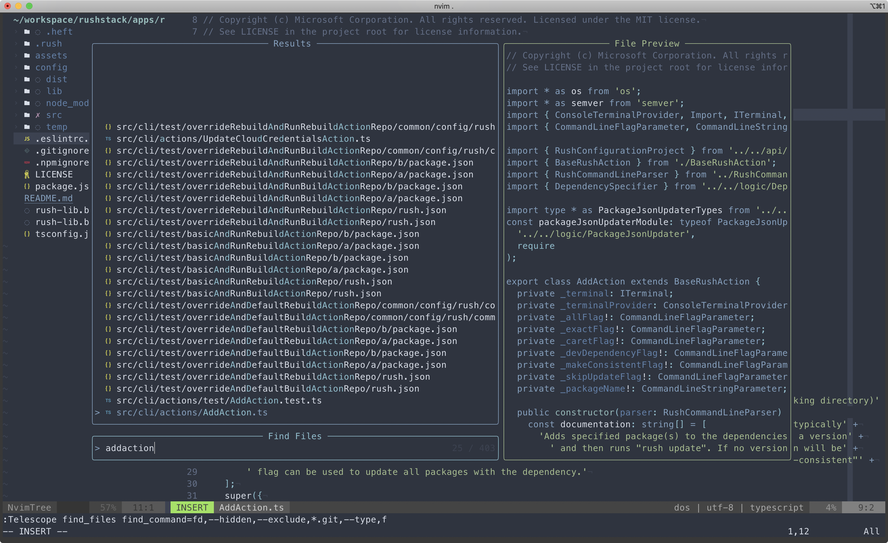

# Dependencies

- neovim >= 0.6
- [Nerd Font](https://www.nerdfonts.com/)
- [sharkdp/fd](https://github.com/sharkdp/fd)

# LSP

```
npm install -g typescript typescript-language-server vscode-langservers-extracted
pnpm install -g eslint@7
```

# Setup

```bash
# clear current config
rm -rf ~/.config/nvim # !!! backup if needed

# link nvim folder under config directory
ln -s <absolute_path>/nvim ~/.config/nvim

# install packages in one line
nvim --headless -c 'autocmd User PackerComplete quitall' -c 'PackerSync'
```

# Screenshots


